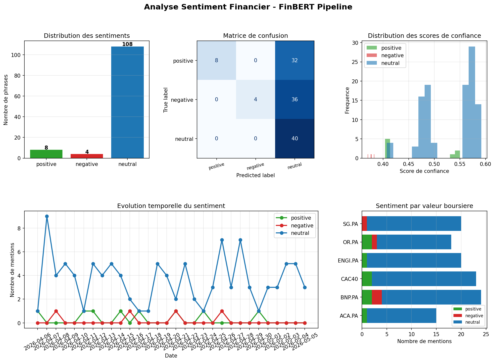

# 🏦 Analyse Sentiment Financier — FinBERT

Pipeline NLP pour l'analyse de sentiment sur des textes financiers (news, rapports, tweets boursiers) avec le modèle **FinBERT** (BERT fine-tuné sur le corpus financier FinancialPhraseBank).

## 📸 Aperçu



## 🎯 Fonctionnalités

- Corpus de **120 phrases financières** annotées (positives / négatives / neutres)
- **Mode DEMO** : classifieur lexical, sans téléchargement (lancement immédiat)
- **Mode FinBERT** : vrai modèle HuggingFace `ProsusAI/finbert` (~85% accuracy)
- Dashboard 5 panneaux : distribution, matrice de confusion, scores de confiance, évolution temporelle, sentiment par ticker
- Analyse par **valeur boursière** (BNP.PA, SG.PA, ACA.PA, CAC40...)
- Export CSV des résultats

## 📈 Performances FinBERT (référence)

| Métrique | Score |
|----------|-------|
| Accuracy | ~85% |
| F1 macro | ~84% |

> Référence : Malo et al. (2014) — FinancialPhraseBank · Araci (2019) — FinBERT

## 🗂️ Structure

```
sentiment-financier-finbert/
├── sentiment_finbert.py        # Pipeline principal
├── data/
│   ├── phrases_financieres.csv # Dataset annoté
│   └── resultats_sentiment.csv # Prédictions
├── docs/
│   └── screenshot_sentiment.png
├── requirements.txt
└── README.md
```

## ⚙️ Installation

```bash
pip install -r requirements.txt

# Pour le mode FinBERT complet :
pip install transformers torch
```

## 🚀 Utilisation

```bash
# Mode démonstration (immédiat, sans GPU)
python sentiment_finbert.py --mode demo

# Mode FinBERT réel (télécharge ~500 MB la 1ère fois)
python sentiment_finbert.py --mode finbert
```

## 💡 Exemple de sortie

```
[OK] The stock plunged 18 percent following a profit warning... | pred=NEGATIVE | conf=73% | SG.PA
[OK] Record quarterly earnings, beating analyst expectations... | pred=POSITIVE | conf=81% | BNP.PA
[OK] The central bank kept interest rates unchanged...          | pred=NEUTRAL  | conf=65% | CAC40
```

## 🏦 Cas d'usage bancaires

- Veille économique automatisée (Reuters, Bloomberg, Les Échos)
- Scoring de risque réputationnel d'une contrepartie
- Suivi du sentiment investisseur sur une valeur boursière
- Analyse de rapports annuels et communications de direction

## 🛠️ Technologies

**Python 3** · **HuggingFace Transformers** · **FinBERT** · **scikit-learn** · **pandas** · **matplotlib**

## 👩‍💻 Auteure

**Vanelle Stéphanie MANGOUA DJOUSSEU** — Recherche d'alternance en IA & Systèmes Embarqués
